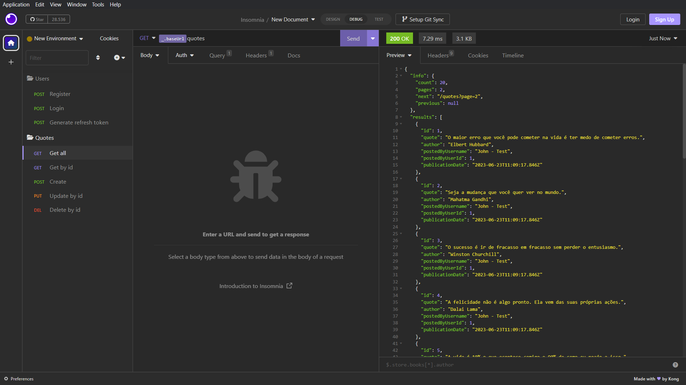
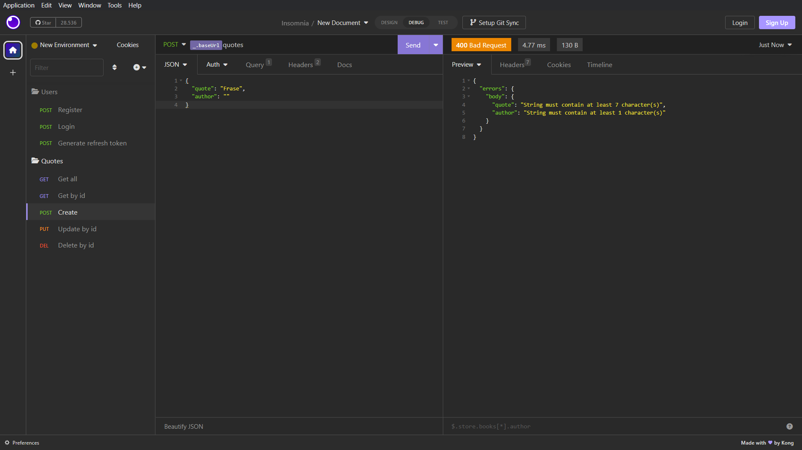

<h1 align="center">Quotes API</h2>
<p align="center">
  
</p>

<p align="center">
  
  
</p>

## Objetivo

Esse é um projeto básico criado com o objetivo de aprender mais sobre APIs/backend, assim como **TypeScript** e **NodeJS**. É um projeto com fins unicamente de estudos.

## ✏ Funcionalidades

A API tem como principal função publicar e obter frases, sendo necessário se registrar para tal. Possui um CRUD completo de frases para usuários logados, com opções de adicionar, obter, atualizar e excluir frases, além de contar com o recurso de paginação ao obter as frases. Os dados são armazenados em um banco de dados **PostegreSQL**.

## 🛠 Principais tecnologias e bibliotecas utilizadas

- [NodeJS](https://nodejs.org/en) e [Express](https://expressjs.com);
- [Knex](https://github.com/knex/knex): Query builder;
- [PostgreSQL](https://www.postgresql.org): Banco de dados;
- [Jest](https://github.com/jestjs/jest) e [SuperTest](https://github.com/ladjs/supertest): Testes de integração;
- [Bcrypt.js](https://github.com/dcodeIO/bcrypt.js): Criptografia de senhas;
- [Zod](https://github.com/colinhacks/zod): Validação de requisições;
- [Http-Status-Codes](https://github.com/prettymuchbryce/http-status-codes): Status codes mais legíveis.

## 🚀 Executar localmente

Estou utilizando o **yarn**, mas você pode utilizar o gerenciador de pacotes de sua preferência. Antes de executar localmente, é necessário definir as variáveis de ambiente no arquivo **.env**. Você precisa criar o arquivo .env e copiar as variáveis do **.env.example**, preenchendo com os valores de configuração adequados.

**IMPORTANTE**: *ACCESS_TOKEN_SECRET_KEY* e *REFRESH_TOKEN_SECRET_KEY* devem ter valores diferentes, caso contrário, um refresh token poderá ser usado como access token.

- **yarn dev**: Executar localmente.
- **yarn test** ou **yarn jest**: Rodar todos os testes.
- **yarn knex:migrate:** Executar migrations.
- **yarn knex:rollback:** Executar rollback.
- **yarn knex:seed:** Executar seeds.

## 📋 API Docs

Rotas **/auth**:
- [Registrar usuário](#registrar-usuário)
- [Login](#login)
- [Refresh token](#refresh-token)

Rotas **/quotes**:
- [Obter todas as frases](#obter-todas-as-frases)
- [Obter frase por id](#obter-frase-por-id)
- [Publicar frase](#publicar-frase)
- [Atualizar frase](#atualizar-frase)
- [Excluir frase](#excluir-frase) 

Manipular erros:
- [Error handling](#error-handling) 

### Registrar usuário

> POST /auth/register

- **Request - Body:**

```json
{
  "email": "Email do usuário",
  "username": "Nome do usuário. Deve conter no mínimo 3 caracteres",
  "password": "Senha do usuário. Deve conter no mínimo 6 caracteres"
}
```

- **Response - Status 201:** ID do usuário registrado (int).

### Login

> POST /auth/login

- **Request - Body:**

```json
{
  "email": "Email do usuário",
  "password": "Senha do usuário. Deve conter no mínimo 6 caracteres"
}
```

- **Response - Status 200:** 

```json
{
  "accessToken": "Access token válido por 1h",
  "refreshToken": "Refresh token válido por 7 dias (ou até ser utilizado para gerar um novo access token)"
}
```

### Refresh token

> POST /auth/refresh-token

- **Request - Body:**

```json
{
  "refreshToken": "Refresh token válido no formato JWT gerado durante o login"
}
```

- **Response - Status 200:** 

```json
{
  "accessToken": "Novo access token válido por 1h",
  "refreshToken": "Novo refresh token válido por 7 dias (ou até ser utilizado para gerar um novo access token)"
}
```

### Obter todas as frases

**NOTA IMPORTANTE:** Todas as rotas de frases são protegidas e precisam de um Authorization Header.  
Passe **Authorization: Bearer ***access token***** no header de requisição.

> GET /quotes

> GET /quotes?page=1

> GET /quotes?filter=conhecimento

> GET /quotes?page=1&filter=conhecimento

- **Response - Status 200:**

```json
{
  "info": {
    "count": 20,
    "pages": 2,
    "next": "/quotes?page=2",
    "previous": null
  },
  "results": [
    {
      "id": 1,
      "quote": "A imaginação é mais importante que o conhecimento.",
      "author": "Albert Einstein",
      "postedByUsername": "John",
      "postedByUserId": 1,
      "publicationDate": "2023-06-21T15:20:28.936Z"
    },
    [...]
  ]
}
```

- **count**: Número total de frases.
- **pages**: Número total de páginas disponíveis.
- **next**: Próxima página. null se não houver nenhuma.
- **previous**: Página anterior. null se não houver nenhuma.
- **results**: Frases encontradas.
- O limite de frases por página é 15.

### Obter frase por id

> GET /quotes/:id

- **Response - Status 200:** 

```json
{
  "id": 1,
  "quote": "A imaginação é mais importante que o conhecimento.",
  "author": "Albert Einstein",
  "postedByUsername": "John",
  "postedByUserId": 1,
  "publicationDate": "2023-06-21T15:20:28.936Z"
}
```

### Publicar frase

> POST /quotes

- **Request - Body:**

```json
{
  "quote": "Frase. Deve conter no mínimo 7 caracteres",
  "author": "Nome do autor"
}
```

- **Response - Status 201:** ID da frase criada (int).

### Atualizar frase

> PUT: /quotes/:id

- **Request - Body:** 

```json
{
  "quote": "Frase atualizada. Deve conter no mínimo 7 caracteres",
  "author": "Nome do autor atualizado"
}
```

- **Response - Status 204:** Não há body de resposta.

### Excluir frase

> DELETE: /quotes/:id

- **Response - Status 201:** Não há body de resposta.

### Error handling

Todos os endpoints que precisam de um **body/params/query** na requisição podem devolver uma **BAD_REQUEST (400)** se a requisição contiver valores inválidos. Exemplos de erros:

- Login:
```json
{
  "errors": {
    "body": {
      "email": "Invalid email",
      "password": "String must contain at least 6 character(s)"
    }
  }
}
```

- Tentar obter todas as frases com **?page=abc**:
```json
{
  "errors": {
    "query": {
      "page": "Expected number, received nan"
    }
  }
}
```

- Atualizar frase com campos no body e id inválidos:
```json
{
  "errors": {
    "body": {
      "quote": "String must contain at least 7 character(s)",
      "author": "String must contain at least 1 character(s)"
    },
    "params": {
      "id": "Expected number, received nan"
    }
  }
}
```

Todos os endpoints podem retornar um body contendo um **error** padrão.

```json
{
  "error": "Invalid email or password"
}
```

Alguns endpoints podem retornar **NOT_FOUND (404)** se o recurso não for encontrado ou a frase não pertencer ao usuário.

- Tentar atualizar ou excluir com o id de uma frase que não existe ou não pertence ao usuário:

```json
{
  "error": "There is no quote with the given id"
}
```

- Tentar obter frases com uma **page** maior do que a quantidade de páginas disponíveis:

```json
{
  "error": "Invalid page, no more items"
}
```